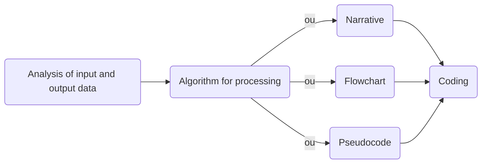
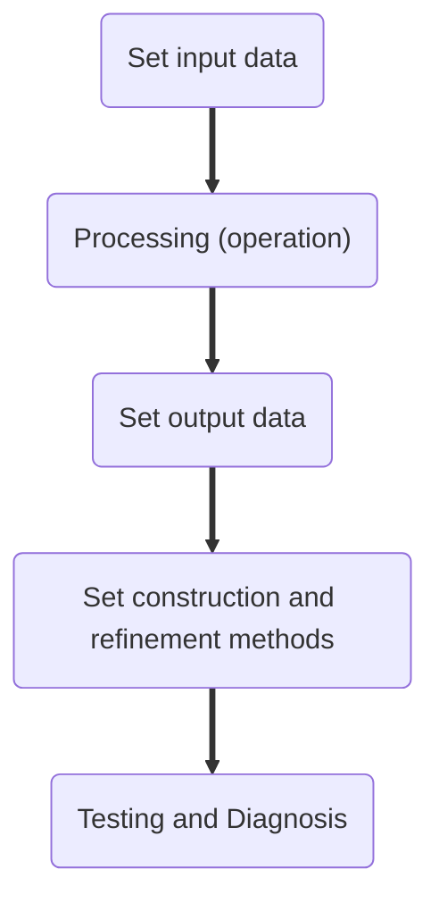
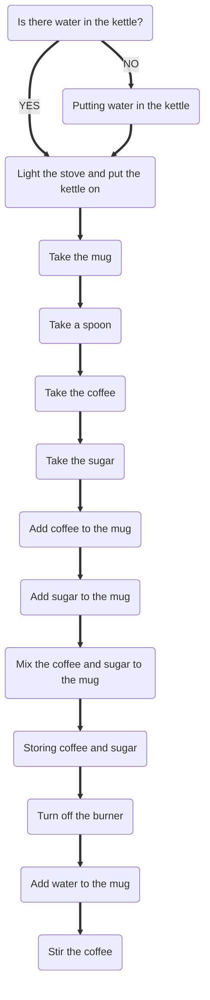

# **Computational Thinking**  

## Definition  
Computational thinking is a strategy for solving problems by "designing" solutions from four pillars: **decomposition**, **pattern recognition**, **abstraction**, and **automation via algorithms**. We can cite **logical reasoning** and **improvement** as complementary skills to the use of computational thinking.  

## Complementary Skills  

 1. Logical Reasoning  
    Logical reasoning consists of structuring reasoning that allows a person to reach a conclusion after using a certain organized structure of thought. In short, there are three types of logical reasoning:  
     - Deduction: a rule and its premise are used to reach a conclusion. This type of reasoning is very closely related to mathematicians, for example.
     - Induction: It is determining a rule from several examples and model situations. This type of reasoning is often associated with scientists, for example.
     - Abduction: Is to determine the premise. It is said that the premise could explain the conclusion, since the premise is obtained from a conclusion and a rule. This type of reasoning is usually attributed to detectives and diagnosticians, for example.  

 2. Improving  
    Every solution must always be perfected. Improvement always seeks a more efficient solution that uses less resources and time to solve a problem. This is why many companies invest in process optimization, because an improved process brings savings and quality. Speaking specifically of software development, one way to improve is by simplifying lines of code and writing clear and straightforward functions in order to produce clean and maintainable code.  

## Computational Thinking Pillars  

### Decomposition  
To decompose is to break down a larger problem into smaller problems. To do this we have two steps: analysis and synthesis.   

 - Analysis: the problem is broken down into smaller problems that are easier to manage and solve.
 - Synthesis: the solutions obtained for each smaller problem are put together to synthesize the overall solution of the original problem.  

The smaller tasks can be executed in two ways: sequentially or in parallel.  

 - Sequentially: one activity depends on the other, which suggests that the solution should be executed as a step-by-step process, where one step follows the other because the next step depends on the previous one.
 - Parallel: tasks are executed together and at the same time, since the next step does not necessarily depend on the previous one. Then everything is put together in a way that makes sense.  

The decomposition of a problem is important because it helps to solve problems and in the maintenance of the solution, since each problem generated in the decomposition can be seen as an isolated element and of the whole at the same time. For example, thinking about programming, the decomposition helps in maintaining the functions and features of the application, for example.  

### Pattern recognition  
It consists of pattern detection after comparison between an object and a reference model. This helps in generalizing the problem and its solution.  

### Abstraction  
Abstracting, abstraction, and generalization have subtle differences.  

 - Abstraction: observing more than one element in order to evaluate its characteristics when isolated from the whole.
 - Abstraction: isolating a certain element from reality.
 - Generalization: is that which explains more cases, being an extrapolation of a specific explanation.  

An example of abstraction would be to analyze the data from a questionnaire with many questions. First, it would be necessary to understand the reason for the research and especially for the analysis. From this understanding, the analyst should study the questions asked to decide which ones are relevant for the analysis. Thus, only these questions are essential for the analysis, which makes the other questions disposable, since we can regard them as details.  
The central idea of abstraction is to make a solution reusable for similar problems by generalizing the solution.  

### Algorithms  
Computers are dumb. We say this because a computer needs to be "taught" by a human in order to do its job, because without instructions it cannot do much. Therefore, instructions tell the computer what needs to be done and in what order.  
It is important that the algorithm is understood by both the human and the machine. Below is a flowchart of how a program can be developed.  

As you can see from the flowchart above, the algorithm can be written in three different ways before being coded: by narrative (Step 1, Step 2, Step 3, ...), by flowchart (geometric figures with text and arrows connecting them), or pseudocode (Portugol, in a "Brazilian way").  

To create an algorithm:  

**`Example: preparing coffee in the "narrative" method`**  

 - Step 1: check if there is water in the kettle. If there is not, add water to the kettle.
 - Step 2: turn on the burner and put the water on to heat.
 - Step 3: pick up your cup.
 - Step 4: take a spoon.
 - Step 5: get the coffee.
 - Step 6: get sugar
 - Step 7: add coffee to mug.
 - Step 8: add sugar to mug.
 - Step 9: mix the coffee and sugar until the water boils.
 - Step 10: turn off the burner.
 - Step 11: add water to the mug.
 - Step 12: stir the coffee.  

**`Example: preparing a coffee mug in the "flowchart" method**  

