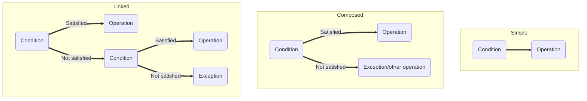

# **Programming logic**  

## Logic  
The concept of logical comes close to the concept of **logical reasoning**, since logic is the use of structured reasoning to think about anything. In IT, it is said that **`logic is the organization and planning of assertive instructions in an algorithm to enable the implementation of a program`**.  

## Logic Techniques  

 1. Linear technique  
    This is a technique that features hierarchical structure used to develop and solve problems. Solution execution is sequenced, resources are limited, and for all intents and purposes this is a one dimensional technique. The elements are ordered logically and sequentially to solve a problem, since one step depends on the other.

 2. Structured Technique  
    A slightly more complex technique, since there are **choice** mechanisms. For example, if you need to write an algorithm for your breakfast, you could write it linearly (whether you like coffee or juice better) or you could use the structured technique if you like both options, and can choose between coffee or juice.

 3. Modular Technique  
    A technique in which independent parts are controlled by a set of rules. The flow chart below shows how the standard Modular Technique model works.  
    
    ```mermaid
    flowchart LR
    A("Input data") ==> B("Transformation processes")
    B ==> C("Output data")
    ```  

    This technique is very much at home with programming, because it allows us to decompose a problem, simplifying the solution of the problem and the maintenance of the code.  

    For example, I could separate into three modules my algorithm that I created to make a coffee: one module to get the things to make the coffee, one for making the coffee, and another to store the things I used to make the coffee.  

## Algorithm Fundamentals  

### Primitive data types  
In short, there are three types of data: **numeric**, **character** and **logical**. Numeric data is divided into integer (non-fractional number) and real (fractional number). Characters, on the other hand, are **alphanumeric**, i.e, they can be letters, numbers, periods, special characters. Finally, logical data is known as **boolean**, because it accepts only two values: true (1 in machine language) or false (0 in machine language).  

### Variables  
A changeable and inconstant structure that is used to store information, which can be data or a data structure, for example. The variable is always restricted to its type, i.e., if it receives a numeric data, it will only be of that type, for example.  
The name chosen for a variable must follow some rules:  

 - The name must make some sense for what is being stored in it;
 - The first letter **`can't`** be a number, but there can be numbers in the name;
 - There can be no blank spaces;
 - It cannot use reserved words for the programming language being used.  

Variables can take on only two roles within an algorithm: they can be either action or control variables. The action variable modifies the state of something, while the control variable is used to control something within an algorithm.  
Although it is called "variable", a variable can be assigned to a constant value (like the value of pi, e.g.). This makes it easier to write values that are repeated in the code.  

### Primitive instructions  
The instructions will handle the data and transform it into the intended output. In short, operators are used so that the instructions can be carried out, and these operators have priority in the order of execution (especially the mathematical operators). The table below shows these signals.  

|Operator|Operation|Type|Priority|Return|
|:------:|:------:|:--:|:--------:|:     :|
|+|Keep sign|Unary|1|Positive|
|-|Invert signal|Unary|1|Negative|
|&uarr;|Exponential|Binary|2|Integer or real|
|/|Fractional division|Binary|3|Real|
|div|Full division|Binary|4|Integer|
|*|Multiplication|Binary|3|Integer or real|
|+|Addition|Binary|4|Integer or real|
|-|Subtraction|Binary|4|Integer or real|  

### Conditional structure  
It is a block of code that checks a certain condition to **choose** what the "answer" to that condition will be. Thus, the conditional structure exercises a Boolean check (true or false) and if the condition is met, a certain operation is performed, while another operation will be performed if the condition is false.  
There are three types of conditional structure:  

 - **`Simple`** ==> Supports only one condition and performs one operation if that condition is satisfied.
 - **`Composed`** ==> Checks if the condition is satisfied. If it is, it performs an operation; if it is not, it performs an exception.
 - **`Linked`** ==> It consists of several nested ifs and if nots. It can handle more than one condition as well.  



Conditional structures are composed of verification commands. For this, relational operators are used, as in the table below:  

|Symbol|Verification|
|:-----:|:---------:|
|=|Equal to|
|<>|Different of|
|>|Greater than|
|<|Less than|
|>=|Greater or equal to|
|<=|Less or equal to|  

We can also use the logical operator of the table below:  

|Symbol|Operator|
|:-----:|:------:|
|AND|AND|
|OR|OR|
|NOT|NOT|  

As with the relational operators, the condition makes a Boolean check. The "AND" operator checks for the intersection between two conditions. Below is the truth table for the "AND" operator:  

|Condition 1|Condition 2|Result|
|:--------:|:--------:|:-------:|
|F|F|F|
|T|F|F|
|F|V|F|
|T|T|T|  

The "OR" operator verifies if at least one condition is true, i.e., if there is an union between the conditions. Below is the true table for the "OR" operator:  

|Condition 1|Condition 2|Result|
|:--------:|:--------:|:-------:|
|F|F|F|
|V|F|T|
|F|T|T|
|T|T|T|  

Finally, the "NOT" operator turn over the logic result. Below is the true table for the "NOT" operator:  

|Condition|Result|
|:------:|:-------:|
|T|F|
|F|T|  

>It is important to note that these operators vary according to the programming language used!  

### Repetition structures  
Repetition structures help to control the flow in a piece of code. Simply copying and pasting a snippet that should be repeated is not a good idea, as it will hurt the maintainability of the code.  
There are three repeat structures: **`While ... do`**, **`Repeat ... until`**, and **`For ... from ... to ... do`**.  
Repetition structures and conditional structures can be written inside each other.  

### Vectors and Matrixes  
Vectors are one-dimensional data structures, serving as a **container** for information/data.  
An array, on the other hand, is a two-dimensional vector organized into **`rows (n)`** and **`columns (m)`**. The information in an array is stored in what is called an **index**, which represents the row and column number of an array element. For example, if we say that we want the element A11, we are saying that we want the element that occupies row 1 and column 1 of the matrix "A".  

### Functions  
Functions are snippets of code that perform specific tasks. Functions are also called modules (especially in **`Object-Oriented Programming``**), which makes them intrinsically linked to the Modular Technique of logic.  
A function is the actual application of the decomposition of a problem. It is identified by its parameters and by its name.  

## Input and output instructions  
Data is entered from various devices, such as keyboard, mouse, cloud synchronization, etc. This input data is part of a program's input instructions.  
Output instructions, on the other hand, are usually printed on the screen or via a printer, for example. There are two types of output: **programmed** and **interrupted** output. The programmed output does not mean that the program is necessarily returning what was desired, because there may be some error in the logic used by the programmer and that is not configured as an error that interrupts the execution of the code. Therefore, the programmed output is the output that can return what is expected or that does not return a known error. The output by interruption, on the other hand, can be obtained from some problem in a peripheral or some other error that interrupts the normal execution of the program (typing or syntax error, for example).
