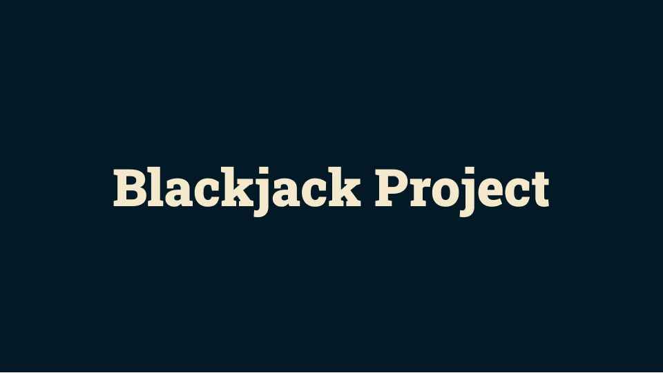
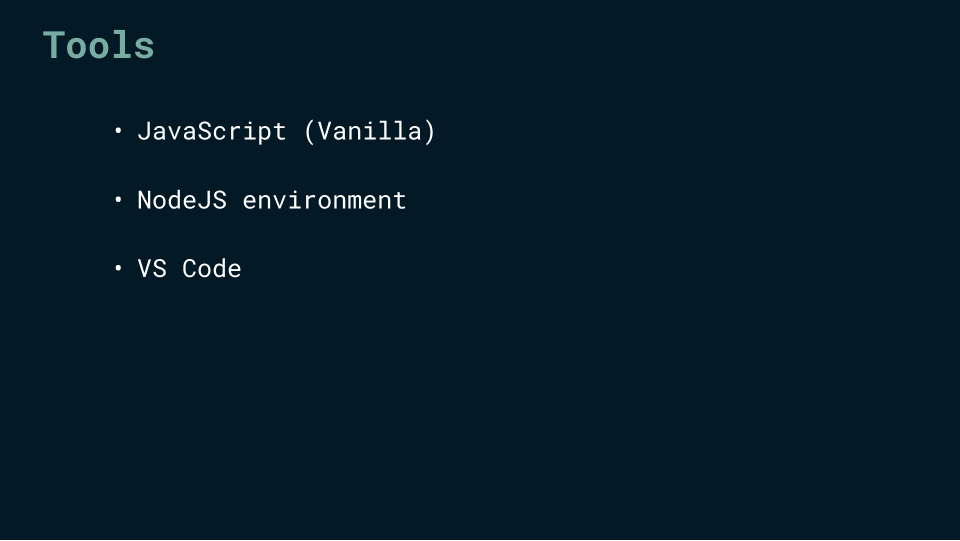
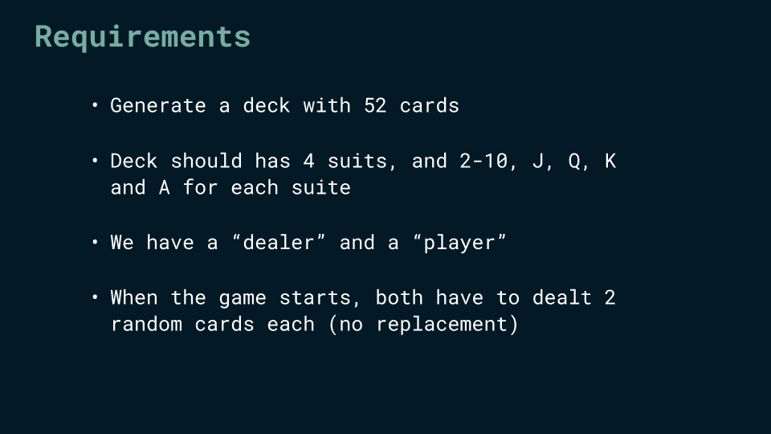
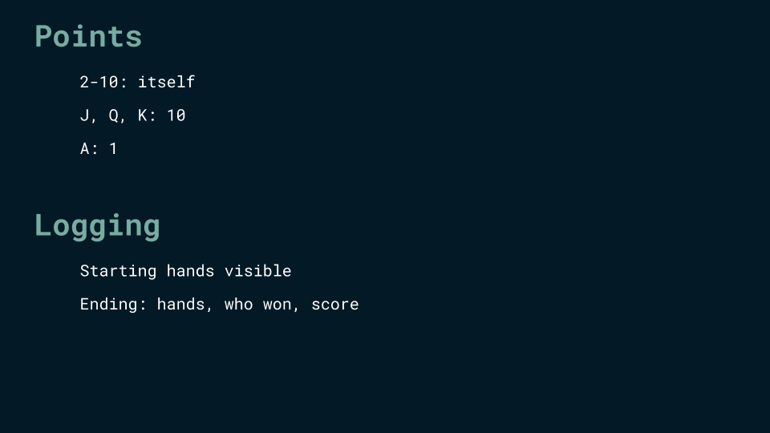

  

[PT-BR](./readmePTBR.md)

# Blackjack game  
This project was proposed in the YouTube playlist [JavaScript in depth](https://www.youtube.com/playlist?list=PLovN13bqAx7D_MFjL0PHnCkYAHMSO8-kU) at the [Tech with Nader](https://www.youtube.com/@TechWithNader) channel.  

## Tools  

  

## Requirements  

  

## Game behavior  

  

## Starting and ending hands  

  

## Breaking down into smaller parts  

### Functions  

#### `newDeck()`  
This function is responsible for creating a deck with 52 cards. Each card (Ace, King, Queen, Jack, 10, 9, 8, 7, 6, 5, 4, 3, 2) will be matched with each suit (Clubs, Diamonds, Hearts, Spades). The function returns a new deck, an array with 52 slots, and each slot is a string with like `[card] of [suit]`, like `10 of hearts`.  

#### `drawCard(deck)`  
This function receives a deck (parameter) and returns a random card of this deck. The logic is simple: the deck is an array with 52 indices. So, if we catch a random index of the array, we have a random card. The `splice()` method will guarantee this card will be **removed** from the original array, since we don't want to have duplicate cards.  

#### `calculatingHandsValue(hand)`  
This function receives a "hand" (parameter) of a player (his cards) and returns the sum of the cards points. Each card has a value: 2-10 is itself; Jack, Queen and King is 10 points, and Ace is 1 point. As I said in the "newDeck" function, I decided to work with an array of strings with like `[card] of [suit]`. So I used the `substring()` method to take just the first one or two characters of the string. I didn't use the brackets notation because of the number "10", since it has two characters. This function returns the sum of the cards in the hand.  

#### `blackjackGame()`  
This is the main function. A new deck is created (`newDeck()`) and both hands (player and dealer) are arrays. In the first round, each player takes two cards (`drawCard()`) and the value of the cards is computed for each player (`calculatingHandsValue(hand)`). A loop controls if a player keeps taking cards or not. If not, it's dealer turn. Here, we have two break points to each player: one when his cards reach 21 points, and one when his cards represents more than 21 points.
