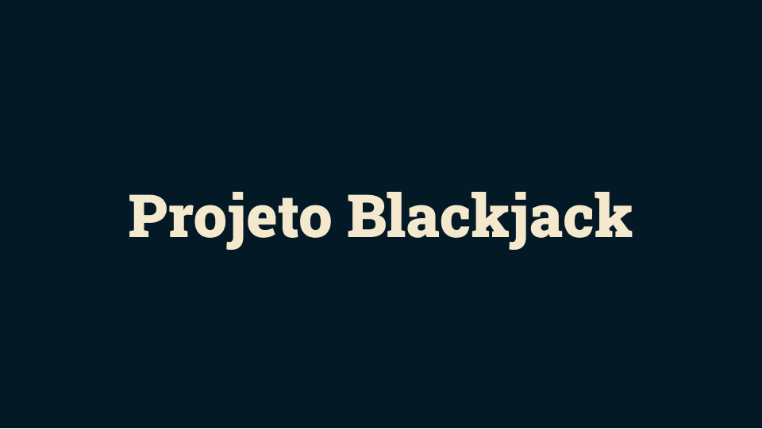
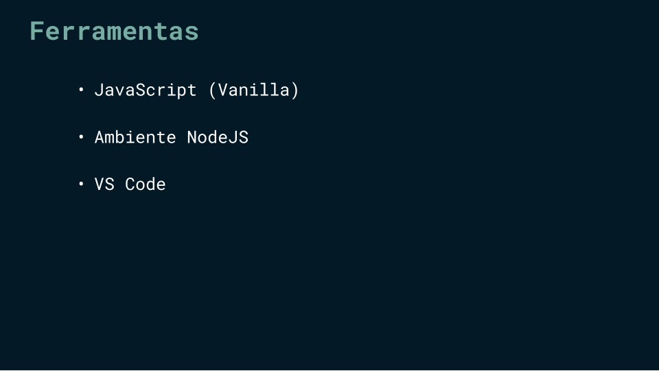
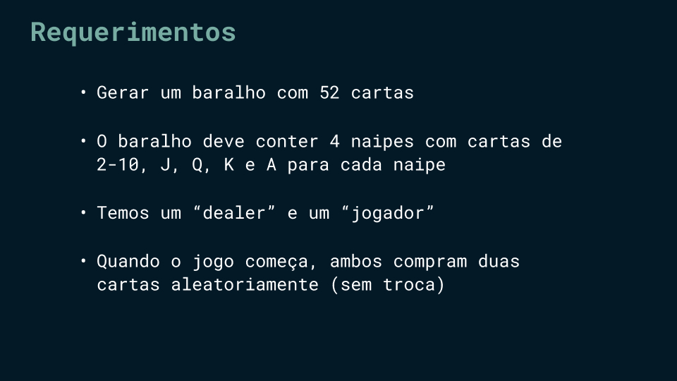
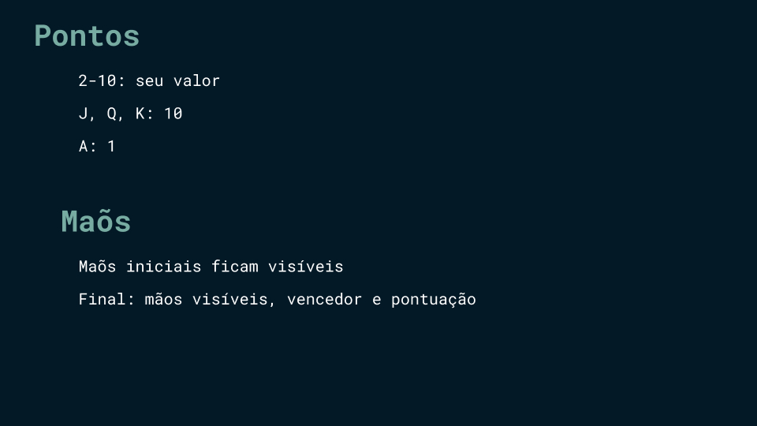

# Blackjack game  
Este projeto foi proposto na playlist [JavaScript in depth](https://www.youtube.com/playlist?list=PLovN13bqAx7D_MFjL0PHnCkYAHMSO8-kU) do canal [Tech with Nader](https://www.youtube.com/@TechWithNader) no YouTube.  

## Ferramentas  

  

## Requerimentos  

  

## Comportamento do jogo  

  

## Mãos no início e no final  

  

## Quebrando em partes menores  

### Funções  

#### `newDeck()`  
Esta função é responsável por criar um baralho com 52 cartas. Cada carta (Ás, Rei, Rainha, Valete, 10, 9, 8, 7, 6, 5, 4, 3, 2) será combinada com cada naipe (Paus, Ouros, Copas, Espadas). A função retorna um novo baralho, um array com 52 espaços, e cada espaço é uma string como `[card] de [suit]`, como `10 of hearts`.

#### `drawCard(deck)`  
Essa função recebe um baralho (parâmetro) e retorna uma carta aleatória desse baralho. A lógica é simples: o baralho é um array com 52 índices. Então, se capturarmos um índice aleatório do array, teremos uma carta aleatória. O método `splice()` garantirá que essa carta será **removida** do array original, já que não queremos ter cartas duplicadas.  

#### `calculatingHandsValue(hand)`  
Esta função recebe uma "mão" (parâmetro) de um jogador (suas cartas) e retorna a soma dos pontos das cartas. Cada carta tem um valor: 2-10 é ela mesma; Valete, Rainha e Rei são 10 pontos, e Ás é 1 ponto. Como eu disse na função "newDeck", decidi trabalhar com um array de strings como `[card] de [suit]`. Então, usei o método `substring()` para pegar apenas o primeiro ou os dois primeiros caracteres da string. Não usei a notação de colchetes por causa do número "10", já que ele tem dois caracteres. Essa função retorna a soma das cartas na mão.  

#### `blackjackGame()`  
Esta é a função principal. Um novo baralho é criado (`newDeck()`) e ambas as mãos (jogador e dealer) são arrays. Na primeira rodada, cada jogador pega duas cartas (`drawCard()`) e o valor das cartas é calculado para cada jogador (`calculatingHandsValue(hand)`). Um loop controla se o jogador continua pegando cartas ou não. Se não, é a vez do dealer. Aqui, temos dois pontos de quebra para cada jogador: um quando suas cartas alcançam 21 pontos e um quando suas cartas representam mais de 21 pontos.
