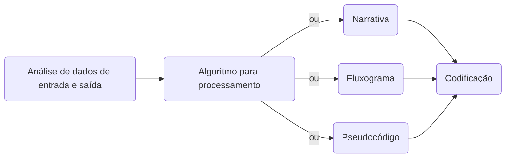
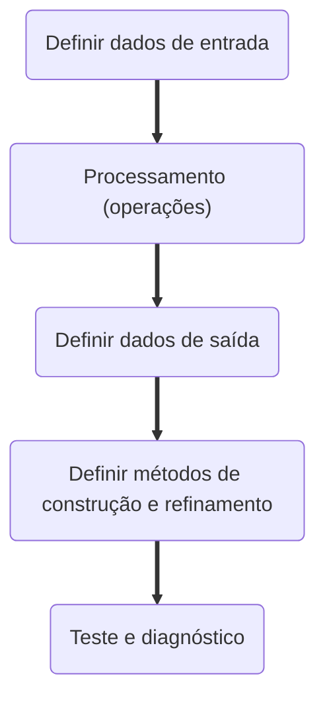
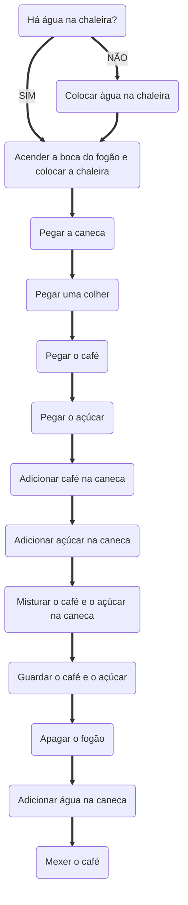

# **PENSAMENTO COMPUTACIONAL**  

## Definição  
O pensamento computacional é uma estratégia para resolução de problemas a partir do "desenho" de soluções a partir de quatro pilares: **decomposição**, **reconhecimento de padrões**, **abstração** e **automação via algoritmos**. Podemos citar o **raciocínio lógico** e o **aperfeiçoamento** como habilidades complementares ao uso do pensamento computacional.  

## Habilidades complementares  

 1. Raciocínio lógico  
    O raciocínio lógico consiste na estruturação de raciocínios que permitam a pessoa chegar a uma conclusão após utilizar uma certa estrutura organizada de pensamento. Em suma, há três tipos de raciocínio lógico:  
     - Dedução: uma regra e sua premissa são utilizadas para chegar a uma conclusão. Esse tipo de raciocínio é muito ligado aos matemáticos, por exemplo.
     - Indução: é determinar uma regra a partir de diversos exemplos e situações modelo. Esse tipo de raciocínio é muito ligado aos cientistas, por exemplo.
     - Abdução: é determinar a premissa. Diz-se que a premissa poderia explicar a conclusão, já que a premissa é obtida a partir de uma conclusão e de uma regra. Esse tipo de raciocínio é geralmente atribuído a detetives e diagnosticistas, por exemplo.  

 2. Aperfeiçoamento  
    Toda solução deve sempre ser aperfeiçoada. O aperfeiçoamento sempre busca uma solução mais eficiente, que utilize menos recursos e tempo para se solucionar um problema. Por isso que muitas empresas investem na otimização de processos, pois um processo aperfeiçoado traz economia e qualidade. Falando especificamente de desenvolvimento de software, uma forma de aperfeiçoar é a partir da simplificação das linhas de código e escrita de funções claras e objetivas a fim de produzir um código limpo e de fácil manutenção.  

## Pilares do pensamento computacional  

### Decomposição  
Decompor é segmentar um problema maior em problemas menores. Para isso, temos duas partes: a análise e a síntese.  

 - Análise: o problema é quebrado em problemas menores, cujo gerenciamento e solução são mais fáceis.
 - Síntese: as soluções obtidas para cada problema menor são reunidas para sintetizar a solução geral do problema original.  

As tarefas menores forem ser executadas de duas formas: sequencialmente ou paralelamente.  

 - Sequencialmente: uma atividade depende da outra, o que sugere que a solução deva ser executada como um passo a passo, em que um passo ocorre após o outro porque o passo seguinte depende do anterior.
 - Paralelamente: as tarefas são executas em conjunto e ao mesmo tempo, visto que não necessariamente o próximo passo depende do anterior. Após, tudo é reunido de uma forma que faça sentido.  

A decomposição de um problema é importante porque auxilia na solução do problema e na manutenção da solução, visto que cada problema gerado na decomposição pode ser encarado como elemento isolado e do conjunto ao mesmo tempo. Por exemplo, pensando em programação, a decomposição auxilia na manutenção das funções e funcionalidades da aplicação, por exemplo.  

### Reconhecimento de padrões  
Consiste na detecção de padrões após comparação entre um objeto e um modelo de referência. Isso auxilia na generalização do problema e da sua solução.  

### Abstração  
Abstrair, abstração e generalização apresentam sutis diferenças.  

 - Abstrair: observar mais de um elemento a fim de avaliar suas características quando isolados do conjunto.
 - Abstração: isolar da realidade um determinado elemento.
 - Generalização: é aquilo que explica mais casos, sendo uma extrapolação de uma explicação específica.  

Um exemplo de abstração seria analisar os dados de um questionário com muitas perguntas. Primeiramente, seria necessário entender o motivo da pesquisa e principalmente da análise. A partir deste entendimento, o analista deve estudar as perguntas realizadas para decidir quais são relevantes para a análise. Assim, apenas essas perguntas são essenciais para a análise, o que torna as outras perguntas descartáveis, visto que podemos encará-las como detalhes.  
A ideia central da abstração é fazer com que uma solução seja reutilizável para problemas similares a partir da generalização da solução.  

### Algoritmos  
Computadores são burros. Dizemos isso porque um computador precisa ser "ensinado" por um humano para que possa realizar as atividades, pois sem instruções ele não pode fazer muita coisa. Portanto, as instruções determinam ao computador o que precisa ser feito e em qual ordem.  
É importante que o algoritmo seja entendido pelo homem e pela máquina.  
Abaixo, segue um fluxograma de como um programa pode ser desenvolvido.  

Como é possível observar no *flowchart* acima, o algoritmo pode ser escrito de três formas diferentes antes de ser codificado: por narrativa (Passo 1, Passo 2, Passo 3, ...), por fluxograma (figuras geométricas com textos e flechas interligando elas), ou pseudocódigo (Portugol).  

Para a construção de um algoritmo:  

**`Exemplo: preparo de uma caneca de café no método "narrativa"`**  

 - Passo 1: verificar se há água na chaleira. Se não houver, adicionar água à chaleira.
 - Passo 2: Ligar a boca do fogão e colocar a água para aquecer.
 - Passo 3: pegar sua xícara.
 - Passo 4: pegar uma colher.
 - Passo 5: pegar o café.
 - Passo 6: pegar o açúcar
 - Passo 7: adicionar café na caneca.
 - Passo 8: adicionar o açúcar na caneca.
 - Passo 9: misturar o café e o açúcar até a água ferver.
 - Passo 10: Desligar a boca do fogão.
 - Passo 11: adicionar água na caneca.
 - Passo 12: mexer o café.  

**`Exemplo: preparo de uma caneca de café no método "fluxograma"`**  

