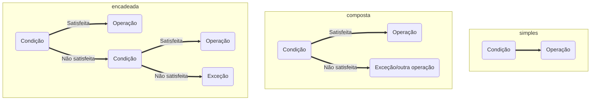

# **Lógica de Programação**  

## 1. Lógica  
O conceito de lógico se aproxima do conceito de *raciocínio lógico*, visto que a lógica é a utilização de um raciocínio estruturado para pensarmos em qualquer coisa. Na área de TI, diz-se que **`"lógica é a organização e planejamento de instruções assertivas em um algoritmo a fim de viabilizar a implantação de um programa."`**.  

## 2. Técnicas de lógica  

 1. Técnica Linear  
    É uma técnica que apresenta estrutura hierárquica utilizada para desenvolver e resolver problemas. A execução da solução é sequenciada, os recursos são limitados, e para todos os fins esta é uma técnica de apenas uma dimensão. Os elementos são ordenados de forma lógica e sequencial para solucionar um problema, visto que um passo depende do outro.

 2. Técnica Estruturada  
    Técnica um pouco mais complexa, visto que há mecanismos de *escolha*. Por exemplo, se você fosse escrever um algoritmo para seu café da manhã, poderia escrever ele linearmente (se você gosta mais de café ou suco) ou poderia usar a técnica estruturada se você gosta das duas opções, podendo escolher entre café ou suco.

 3. Técnica Modular  
    Técnica em que partes independentes são controladas por um conjunto de regras. O fluxograma abaixo mostra como funciona o modelo padrão da Técnica Modular.

    ```mermaid
    flowchart LR
    A("Dados de entrada") ==> B("Processos de transformação")
    B ==> C("Dados de saída")
    ```  

    Essa técnica casa muito com a programação, pois ela nos permite decompor um problema, simplificando a solução do mesmo e a manutenção do código. Por exemplo, eu poderia separar em três módulos aquele meu algoritmo que criei para fazer um café: um módulo para pegar as coisas para preparar o café, um para o preparo do café, e outro para guardar as coisas que usei para fazer o café.  

## 3. Fundamentos de algoritmos  

### 3.1. Tipos primitivos de dados  
Em suma, há três tipos de dados: numéricos, caracteres e lógicos. Os dados numéricos são divididos em inteiros (número não fracionário) e real (número fracionário). Os caracteres, por sua vez, são *alfanuméricos*, isto é, podem ser letras, números, pontos, caracteres especiais. Finalmente, os dados lógicos são conhecidos como *boolianos*, pois aceitam apenas dois valores: verdadeiro (1 em linguagem de máquina e V. ou S. no português estruturado) ou falso (0 em linguagem de máquina e F. ou N. no português estruturado).  

### 3.2. Variáveis  
Estrutura mutável e inconstante que é utilizada para armazenar informação, podendo ser um dado ou uma estrutura de dados, por exemplo. A variável sempre está restrita ao seu tipo, isto é, se ela recebe um dado numérico, ela será apenas daquele tipo, por exemplo.  
O nome escolhido para uma variável deve seguir algumas regras:  
    - O nome deve fazer algum sentido para aquilo que está sendo guardado nela;
    - A primeira letra **`não pode`** ser um número, mas podem haver números no nome;
    - Não pode haver espaços em branco;
    - Não pode utilizar palavras reservadas para a linguagem de programação utilizada.  

As variáveis podem assumir apenas dois papéis dentro de um algoritmo: ela pode ser de ação ou de controle. A variável de ação modifica o estado de algo, enquanto a de controle é utilizada para controlar algo dentro de um algoritmo.  
Apesar de ser denominada "variável", uma variável pode receber uma constante (como o valor do pi, por exemplo). Isso facilita na escrita de valores que são repetidos no código.  

### 3.3. Instruções primitivas  
As instruções são aquilo que irão tratar os dados e transformá-los no que se objetiva na saída. Em suma, utilizam-se operadores para que as instruções possam ser realizadas, sendo que esses operadores apresentam prioridade na ordem de execução (sobretudo os operadores matemáticos). A tabela abaixo mostra esses sinais.  

|Operador|Operação|Tipo|Prioridade|Retorno|
|:------:|:------:|:--:|:--------:|:     :|
|+|Manter sinal|Unário|1|Positivo|
|-|Inverter sinal|Unário|1|Negativo|
|&uarr;|Exponencial|Binário|2|Inteiro ou real|
|/|Divisão fracionada|Binário|3|Real
|div|Divisão inteira|Binário|4|Inteiro|
|*|Multiplicação|Binário|3|Inteiro ou real|
|+|Adição|Binário|4|Inteiro ou real|
|-|Subtração|Binário|4|Inteiro ou real|  

### 3.4. Estrutura condicional  
É um bloco de código que verifica uma determinada condição para **escolher** qual será a "resposta" para aquela condição. Logo, a estrutura condicional exerce uma verificação booliana (verdadeiro ou falso) e, se a condição for satisfeita, uma determinada operação é executada, enquanto outra operação será executada se a condição for falsa.  

Há três tipos de estruturas condicionais:  
 - **`Simples`** ==> Comporta apenas uma condição e executa uma operação se aquela condição for satisfeita.
 - **`Composta`** ==> Verifica se a condição é satisfeita. Se for, executa uma operação; se não for, executa uma exceção.
 - **`Encadeada`** ==> Consiste em vários se/senão aninhados. Pode tratar de mais de uma condição também.  



As estruturas condicionais são compostas por comandos de verificação. Para isso, utilizam-se operadores relacionais, conforme na tabela abaixo:  

|Símbolo|Verificação|
|:-----:|:---------:|
|=|Igual a|
|<>|Diferente de|
|>|Maior que|
|<|Menor que|
|>=|Maior ou igual que|
|<=|Menor ou igual que|  

Também podem ser utilizados operadores lógicos, como na tabela a seguir:  

|Símbolo|Operador|Significado|
|:-----:|:------:|:---------:|
|AND|AND|e|
|OR|OR|ou|
|NOT|NOT|não|  

Assim como nos operadores relacionais, a condição faz uma verificação booliana.  
O operador "AND" verifica a intersecção entre duas condições. Abaixo, a tabela verdade para o operador "AND":  

|Condição 1|Condição 2|Resultado|
|:--------:|:--------:|:-------:|
|F|F|F|
|V|F|F|
|F|V|F|
|V|V|V|  

O operador "OR" verifica se ao menos uma é verdadeira, isto é, se há união entre as condições. Abaixo, a tabela verdade para o operador "OR":  

|Condição 1|Condição 2|Resultado|
|:--------:|:--------:|:-------:|
|F|F|F|
|V|F|V|
|F|V|V|
|V|V|V|  

Finalmente, o operador "NOT" inverte o resultado lógico. Abaixo, a tabela verdade para o operador "NOT":  

|Condição|Resultado|
|:------:|:-------:|
|V|F|
|F|V|  

>É importante salientar que esses operadores variam de acordo com a linguagem de programação utilizada!  

### 3.5. Estruturas de repetição  
As estruturas de repetição auxiliam a controlar o fluxo em um trecho do código. Simplesmente copiar e colar um trecho que deve ser repetido não é uma boa ideia, pois prejudicará a manutenção do código.  
Há três estruturas de repetição: **`Enquanto ... faça`**, **`Repita ... até`**, e **`Para ... de ... até ... faça`**.  
As estruturas de repetição e as estruturas condicionais podem ser escritas uma dentro das outras.  

### 3.6. Vetores e Matrizes  
Os vetores são estruturas de dados unidimensionais, servindo como um *container* para a informação/dado.  
A matriz, por sua vez, é um vetor bidimensional organizado em **`linhas (n)`** e **`colunas (m)`**. A informação de uma matriz é armazenada no que é chamado de *índice*, que representa o número da linha e da coluna de um elemento da matriz. Por exemplo, se falarmos que queremos o elemento A11, estamos dizendo que queremos o elemento que ocupa a linha 1 e coluna 1 da matriz "A".  

### 3.7. Funções  
As funções são trechos de código que realizam tarefas específicas. As funções também são chamadas de módulos (sobretudo em **`Programação Orientada a Objetos`**), o que as torna intrinsecamente ligadas à Técnica Modular de lógica.  
Uma função é a aplicação real da decomposição de um problema. Ela é identificada por seus parâmetros e pelo seu nome.  

## 4. Instruções de entrada e saída  
Os dados são inseridos a partir de diversos dispositivos, como teclado, mouse, sincronização com nuvem, etc. Esses dados inseridos fazem parte das instruções de entrada de um programa.  
As instruções de saída, por sua vez, são geralmente impressas na tela ou via impressora, por exemplo. Há dois tipos de saída: a *programada* e a por *interrupção*. A saída programada não quer dizer que o programa está necessariamente retornando o que era desejado, pois pode haver algum erro da lógica utilizada pelo programador e que não é configurado como um erro que interrompa a execução do programa. Portanto, a saída programada é a saída que pode retornar o esperado ou que não retorna erro conhecido. A saída por interrupção, por sua vez, pode ser obtida a partir de algum problema em um periférico ou algum outro erro que interrompa a execução normal do programa (erro de digitação ou sintaxe, por exemplo).
