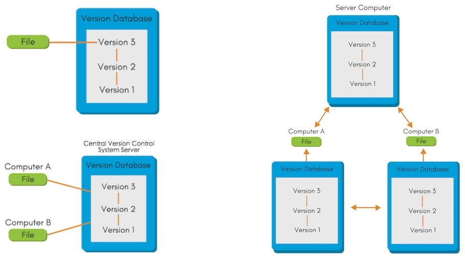

# GIT E GITHUB  

## 1. Versionamento  
O versionamento é importante na criação de códigos, roteiros, tarefas escolares ou universitários, e até mesmo para escrever livros ou textos. Todo mundo já utilizou algum tipo de versionamento mesmo sem perceber. Provavelmente você já usou versionamento se já fez relatórios na faculdade, por exemplo, visto que deve ter salvo (em nuvem ou local) várias versões antes de ter uma versão final. Isso se chama "Sistema de Controle de Versão Local". O problema com este tipo de versionamento é que provavelmente funcionará para projetos pequenos, mas pode ser um fator complicador se você estiver trabalhando em um projeto grande ou se seu projeto envolver muitas pessoas.  
A primeira vez que o versionamento se tornou um assunto real foi em 1972, quando Marc Rochkind desenvolveu o Sistema de Controle de Código Fonte (ou SCCS). Entretanto, o software teve seu lançamento público somente em 1976. Desde então, muita coisa mudou quando falamos de Sistemas de Controle de Versão. Em 1982, o RCS (ou Sistema de Controle de Revisão) foi lançado e assumiu o controle do mercado. Em 1986, o CVS (ou Sistema de Versões Concorrentes) foi lançado como um front-end para o RCS. Este software foi dominante até 2004, quando a Apache lançou o SVN (ou Subversion). Hoje, GIT é o software que é mais frequentemente usado.  

### 1.1. Benefícios do versionamento  
- Controle de histórico: versionar um projeto é sinônimo de "controlar o histórico de seu projeto". Isso significa que você pode analisar cada etapa do projeto e até mesmo desfazer uma etapa ou obter uma versão anterior da mesma.
- Trabalho em equipe: Muitas pessoas podem trabalhar no mesmo projeto ao mesmo tempo, sem conflito de versões.
- Marcação e recuperação de versões estáveis: você pode marcar uma edição estável para resgatá-la sempre que quiser.
- Branching: o projeto pode ser dividido em diferentes tópicos que podem ser trabalhados em paralelo sem que um interfira com o outro.
- Segurança: basicamente, cada software ou VCS tem uma maneira de controlar e prevenir a invasão de agentes maliciosos, e cada desenvolvedor tem uma chave única para acessar o projeto.
- Rastreabilidade: quase todos os VCS podem ajudar você a conhecer o local, o estado e a qualidade de um arquivo.
- Organização: alguns softwares VCS permitem o controle da origem de todo o projeto através de um design de front-end.
- Confiança: como você pode trabalhar com repositórios remotos (nuvem), perder seus arquivos é realmente improvável, e você pode criar novos projetos sem afetar outros.  

## 2. Tipos de Sistemas de Controle de Versão  
Há três classes para o Sistema de Controle de Versão:  
- Local: discutido anteriormente.  
- Centralizado: o desenvolvedor precisa ter uma conexão constante com um servidor único (repositório central) para "comitar" as mudanças do projeto. Este servidor tem todos os arquivos de controle de versão (versões) sobre e de cada cliente. Esta é a classe de softwares como SCCS, RCS e CVS.  
- Distribuído: o desenvolvedor clonará um repositório com arquivos e histórico, minimizando o potencial de perder tudo se algo ruim acontecesse com o servidor. Estes sistemas lidam muito bem em ter vários repositórios remotos, uma vez que a colaboração é otimizada de diferentes maneiras. Esta é a classe de softwares como Mercurial e GIT.  

FIGURA 1 - Tipos de VCS  

  

## 3. GIT  
Agora que sabemos algo sobre a história e o que é VCS, é hora de falar sobre GIT, um VCS de código aberto distribuído. O GIT foi criado por Linus Torvalds (criador do Linux) em 2005. Linus detestava usar CVS e SVN no projeto do kernel do Linux, e começou a usar o BitKeeper (um VCS privado). No início, a BitMover permitia o uso livre da ferramenta. Entretanto, momentos depois, eles tentaram dificultar o acesso para os desenvolvedores Linux, cobrando o uso da ferramenta. Linus rompeu o relacionamento com a BitMover e começou a criar seu próprio VCS (GIT).  

### 3.1. Criptografia SHA1  
O SHA1 é um algoritmo de criptografia, isto é, ele é responsável por criptografar arquivos. O principal objetivo do uso deste algoritmo é garantir que o arquivo alvo seja criptografado a fim de garantir uma identificação única e segura. A encriptação do arquivo com o algoritmo SHA1 irá gerar um código de 40 caracteres que servirá como um **identificador único** do arquivo. Por exemplo:  

```bash
echo "Hello World" | openssl sha1
(stdin)= b6b33b33738b3ec36a8a825fc1f278cf913c91d3
```  

Ao rodar no terminal a primeira linha do código acima, foi gerado um código de 40 caracteres que é o identificador único do texto "Hello World". Agora, veja o que ocorre com o código criptografado quando adicionamos uma vírgula entre "Hello" e "World".  

```bash
echo "Hello, World" | openssl sha1
(stdin)= 4ab299c8ad6ed14f31923dd94f8b5f5cb89dfb54
```  

Veja acima que o código de 40 dígitos mudou, pois houve uma alteração no texto original. Agora, veja o que ocorre quando mudamos a palavra "World" para "world".  

```bash
echo "Hello, World" | openssl sha1
(stdin)= 7b4758d4baa20873585b9597c7cb9ace2d690ab8
```  

O código de 40 dígitos foi novamente alterado, pois tivemos uma nova alteração no nosso texto inicial. Agora, veja o que ocorre quando rodamos novamente o primeiro texto.  

```bash
echo "Hello World" | openssl sha1
(stdin)= b6b33b33738b3ec36a8a825fc1f278cf913c91d3
```  

Como é possível observar, foi gerado o mesmo código de encriptação do primeiro caso, o que comprova que a chave de identificação é **única e intransferível**!  

### 3.2. Objetos internos do GIT  

Em suma, o GIT trabalha com três objetos internos: ****blob*, *tree* e commit***.  

- *blob*: objeto responsável por armazenar os metadados GIT do arquivo ou *string*. Os principais elementos em um *blob* são o tipo do arquivo, o tamanho, os caracteres **\0** e, finalmente, o arquivo ou texto que será armazenado nesse objeto.  
- *tree*: objeto GIT responsável por armazenar *blobs* e apontar para os mesmos. As *trees* montam toda a estrutura de armazenamento dos arquivos, sendo formadas pelo tipo (*tree*), pelos caracteres **\0**, pelos objetos armazenados (*blob*) e sua localização, pelos códigos SHA1 e pelo arquivo armazenado nessa estrutura. As *trees* são objetos recursivos, isto é, elas podem armazenar e apontar para outras *trees* (assim como o sistema de diretórios de um Sistema Operacional, por exemplo). Vale lembrar que o código SHA1 de uma *tree* é alterado toda vez que o objeto *blob* ou *tree* contido nela também é alterado.  
- *commit*: objeto GIT que junta tudo em um só lugar. O *commit* é formado por *trees*, por um parente, pelo autor, por uma mensagem e por um *timestamp* que serve para definir uma data e hora para a criação daquele objeto e de seu conteúdo, criando um histórico de alterações realizadas naquele objeto. Isso é extremamente útil, pois literalmente nos dá o poder de "voltar no tempo", isto é, voltar em um *commit* específico para recuperá-lo.  

A Figura 2 mostra que um *commit* aponta para uma *tree* que, por sua vez, aponta para um ou mais *blobs*. Qualquer alteração em um *blob* gera um novo hash, assim como também altera o hash da *tree* e do *commit*, originando um histórico temporal de alterações.  

FIGURA 2: Objetos internos do GIT  

  

Fonte: CHACON, STRAUB, 2022  

## 4. Estágios e *commits*  
A Figura 3 apresenta os estágios que ocorrem antes do *commit* de um repositório GIT.  

FIGURA 3 - Estágio dos *commits*  

  

Fonte: MAHARJAN, 2019  

Utiliza-se o comando **`git status`** para verificar o *status* de um arquivo ou repositório. Em suma, há cinco estágios no GIT: *Untracked*, *Unmodified*, *Modified*, *Staged* e *Committed*.  

- *Untracked* --> Este estágio quer dizer que o GIT não "gravou" o arquivo ainda. Este é geralmente o estágio inicial de um arquivo recém criado. Para que o GIT "grave" a mudança, utiliza-se o comando **`git add`** para adicionar a mudança na fila de *staged*.  
- *Staged* --> Este estágio quer dizer que as mudanças estão prontas para *commit*. O arquivo pode ser retirado desse estágio através do comando **`git rm --cached <nomedoarquivo>`**.  
- *Committed* --> Este estágio quer dizer que foi houve o *commit* do arquivo, isto é, as mudanças realizadas no arquivo já estão no repositório. Para realizar um *commit*, utiliza-se o comando **`git commit -m "Uma mensagem breve resumindo o *commit*"`**, em que a *flag* "-m" representa a mensagem do *commit*.  
- *Modified* --> Este *status* significa que modificações foram realizadas no arquivo ou repositório. Para que as modificações sejam alteradas para o *Staged*, é necessário utilizar o comando **`git add`**.  

## 5. GitHub  
O GitHub age como um servidor remoto que armazena repositórios GIT. É necessário tomar cuidado, pois o que é feito dentro do GitHub não é salvo no repositório local (computador), o que pode causar conflitos.  
O comando utilizado para sincronizar o repositório local com o servidor remoto é o **`git push`**. É interessante observar que o GIT e o GitHub trabalham com *branches*, isto é, ramificações que armazenam alterações específicas de arquivos na linha do tempo de desenvolvimento do mesmo.  
A *branch* principal é chamada de *master* e todas as outras *branches* criadas devem ser sincronizadas com a *master* em algum momento. Essa ação é chamada de *merge*, e não é incomum haver conflito de *merge* em grandes projetos. Em projetos menores, por sua vez, o conflito de *merge* mais comum é aquele em que uma alteração é salva diretamente no GitHub **antes** de ser salva no repositório GIT local. Esses conflitos são geralmente solucionados quando utilizamos o comando **`git pull`** para "puxar" o que está no repositório remoto para o repositório local.  
Note que a diferença entre os comandos **`git pull`** e **`git clone`** é evidente, uma vez que o primeiro trata de sincronizar apenas as **diferenças** entre os repositórios remoto e local, enquanto o último trata de fazer uma cópia idêntica de **todo** o repositório remoto para o computador da pessoa desenvolvedora.  

## **Referências**
- CHACON, S.; STRAUB, B. **Pro Git**, 2nd ed. Apress, 2022. Disponível em: [https://git-scm.com/book/en/v2](https://git-scm.com/book/en/v2).  
- MAHARJAN, Y. **An Intro: Git and GitHub for Starters**. Disponível em: [Medium](https://blog.lftechnology.com/an-intro-git-and-github-for-starters-1525a1d8c40).
